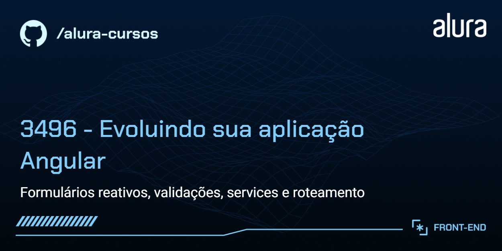

# Indexa

Uma aplicação para manipulação de contatos de uma agenda.

## 🔨 Funcionalidades do projeto

O App lista os contatos, exibindo nome e telefone, de acordo com a letra inicial e possui um filtro interativo. 
Neste curso, será desenvolvida a tela de formulário, para adição de novos contatos à lista.

## ✔️ Técnicas e tecnologias utilizadas

As técnicas e tecnologias utilizadas pra isso são:

- `Formulários Reativos`: implementação de formulários reativos usando FormGroup e FormControl
- `Validações`: aplicação de validações dinâmicas utilizando a classe Validators para aprimorar a qualidade dos dados
- `Manipulação de erros e mensagens`: utilização de @if para renderizar mensagens de erro de forma condicional, acessando a propriedade errors
- `Services e injeção de dependências`: implementação e utilização de services para promover a modularidade e reusabilidade do código, além de explorar a injeção de dependências
- `Configuração de rotas`: configuração eficiente do arquivo de rotas para navegação fluida e estratégias de roteamento
- `RouterLink e Navigate`: exploração do routerLink para facilitar redirecionamentos no template, bem como uso do serviço router e método navigateByUrl para navegação programática.

## 📁 Link do Figma

Você pode [acessar o figma do projeto aqui](https://www.figma.com/file/uXjoavDEvDjyE8LsXgliGx/Indexa-%7C-Angular---Primeiros-Passos?type=design&node-id=241-4472&mode=design&t=wRERwIPB7NC0Xw7z-0).

## 🛠️ Abrir e rodar o projeto

Você vai precisar do NodeJS, versão 18 ou maior.

Após baixar o projeto, você precisa instalar as dependências utilizando o comando:

```bash
npm install
```

Depois, para executar o projeto em modo desenvolvimento:

```bash
ng serve
```

Depois, acesse [http://localhost:4200/](url) no seu navegador.
